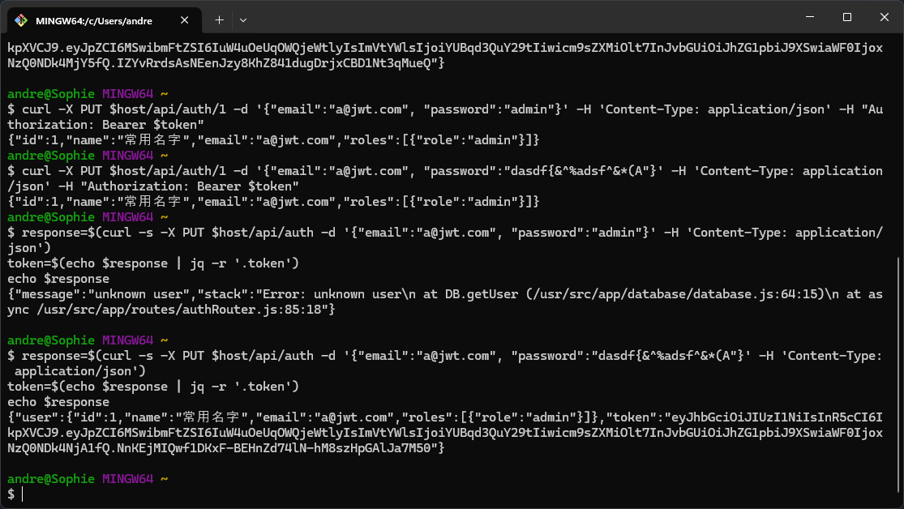
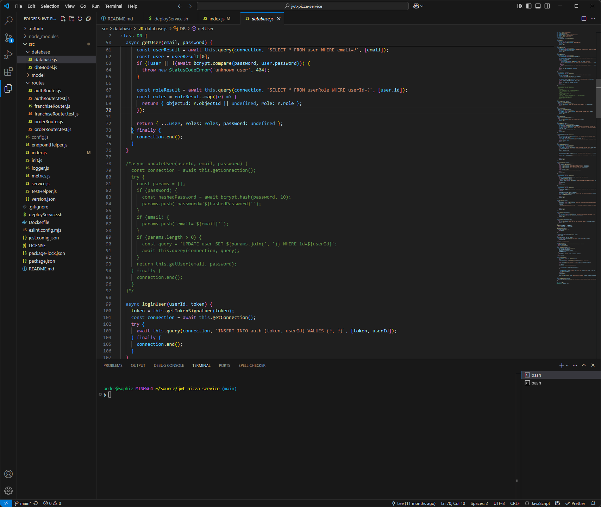
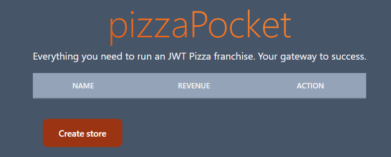
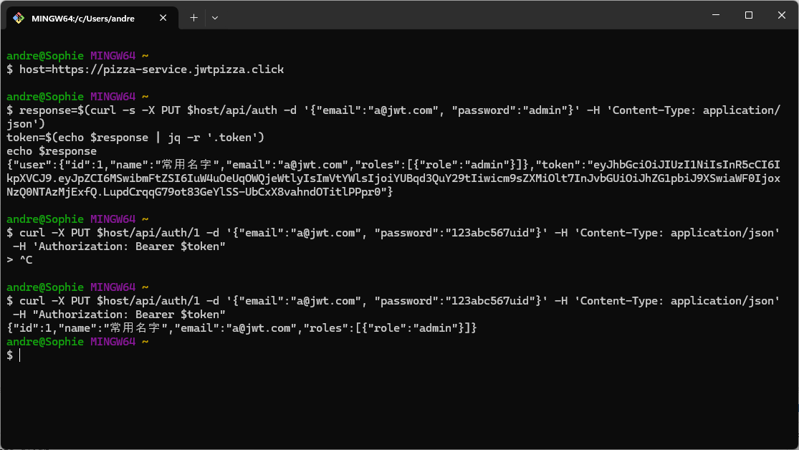
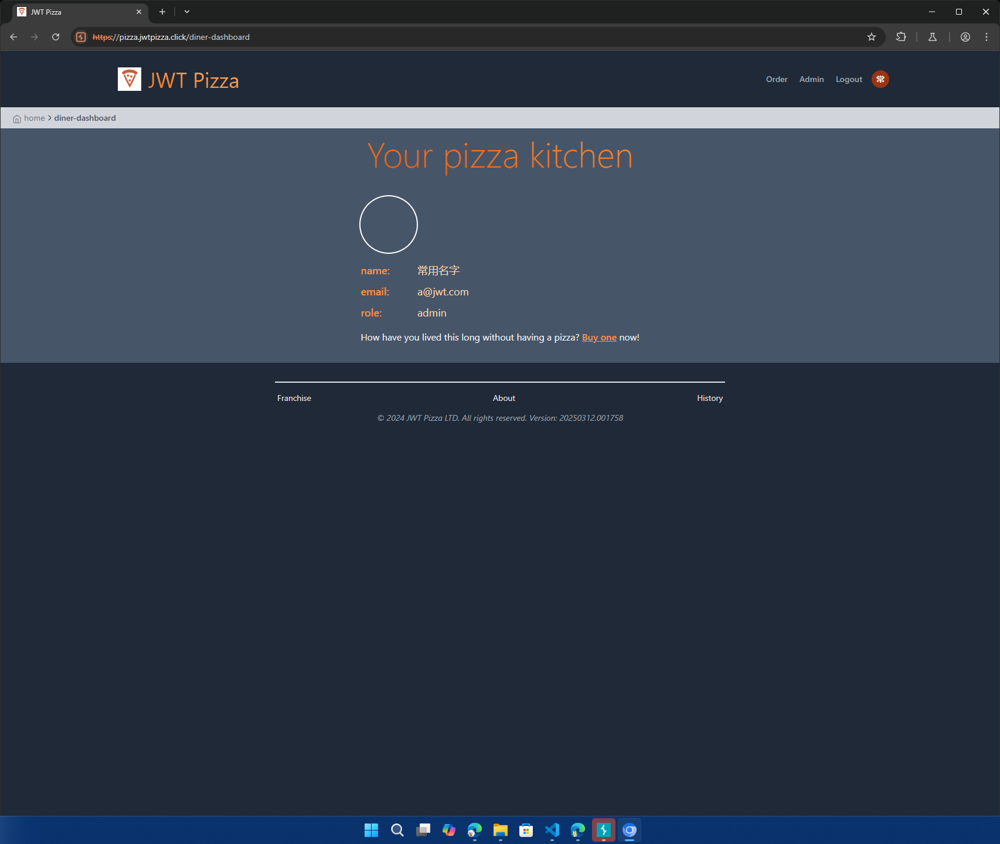
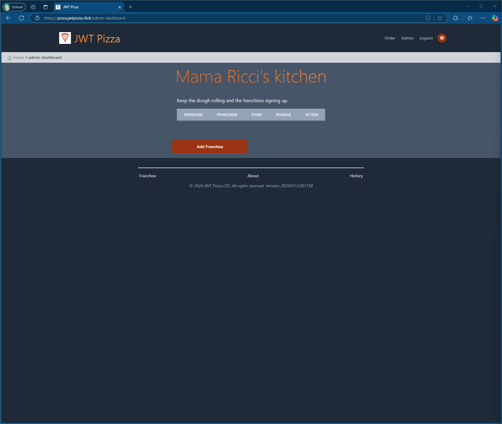
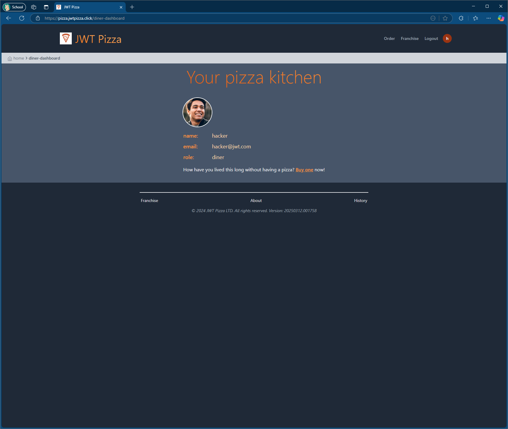

# Peer Penetration Testing Report: Vincent Reiley and Andrew Redd

| Owner | URL |
|------|--------|
| Vincent Reiley | pizza.jwtpizza.click |
| Andrew Redd | pizza.voodle.click |

## Self Attack: Vincent Reiley

### April 10th, 2025 Incident

| Item | Result |
|------|--------|
| Date | April 10, 2025 |
| Target | pizza.jwtpizza.click |
| Classification | 5 |
| Severity | 2 |
| Description | Self-target: With admin permissions, deleted all franchises |
| Image |  |
| Corrections | I changed the admin password (at least I thought I did) |

---

## Self Attack: Andrew Redd

### Personal successful attack record

| Item | Result |
|------|--------|
| Date | April 12, 2025 |
| Target | pizza.voodle.click |
| Classification | Security Misconfiguration |
| Severity | 2 |
| Description | Self-target: Used non GUI accessible method to updateUser change default passwords for admin |
| Image |  Default admin password changed|
| Corrections | With access to default passwords was able to change passwords of admin, I was also able to use Burp Intruder to test a list I created of most common passwords which could have been augmented with english language dictionary or the Turbo intruder extension. I also added a 1 second delay to all middleware responses so attempted password checks would be greatly reduced |

### Personal failed attack record

| Item | Result |
|------|--------|
| Date | April 12, 2025 |
| Target | pizza.voodle.click |
| Classification | Insecure Design |
| Severity | 4 |
| Description | Self-target: non GUI accessible method updateUser capable of changing user information |
| Image |  Default admin password unable to be changed due to disabled method|
| Corrections | Because of my previous penetration test being able to find the default password with test using intruder then changing the password, I disabled the Update user method that wasn't accessible from the gui which kept me from changing passwords of known users along with my previous administrator password change to alphanumeric I was unable to discover the admin password and delete franchises that way. |

### Personal Findings: Andrew Redd

I learned from my personal penetration testing what ways I can protect against attacks and exploits. Things that I exploited on my personal tests, I figured out ways to prevent them and those were the exploits I attempted on my partner. I also learned about compartmentalizing more user permissions, for example I forgot to change the known franchise owner account password before disabling the ability to change the passwords of users and this was exploited by Vincent Reiley in his penetration testing of my distribution to add and remove franchises under the control of that account. Franchise owners probably should have some verification before they can delete everything in their fields of control to prevent database destruction. I also attempted some other exploits that should work but
 I'm not as proficient in sql and sql injection and was unable exploit them on myself or on my partner.

## Peer Attack: Vincent Reiley attacking Andrew Redd

### April 12th, 2025 Incident

| Item | Result |
|------|--------|
| Date | April 12, 2025 |
| Target | pizza.voodle.click |
| Classification | 5 |
| Severity | 3 |
| Description | With franchisee access, deleted stores pertaining to default franchisee and added a fake store. |
| Image |  |
| Corrections | I changed the password of both the admin and the franchisee users to prevent unauthorized access to them |

## Peer Attack: Andrew Redd attaching Vincent Reiley

### Peer successful attack record

| Item           | Result                                                                         |
| -------------- | ------------------------------------------------------------------------------ |
| Date           | April 12, 2025                                                                 |
| Target         | pizza.jwtpizza.click                                                           |
| Classification | Security Misconfiguration                                                      |
| Severity       | 2                                                                              |
| Description    | Peer-target: Administrator Credentials set to default and hidden methods accessible from console to change defaults|
| Images         |    Changed target Admin Password to alphanumeric password to avoid easily breaking back in.    Logged Into Default Admin   Deleting Franchises|
| Corrections    | lots of the vulnerabilities come from the updateUser method in the database.js it really only can be accessed by curl calls at an administrator level. A correction I used in my personal deployment was to change my admin password to something alphanumeric so it wouldn't be easily tested or guessed using Turbo Intruder or Intruder from Burp Suite then I disabled updateUser in my deployment when we were pair penetration testing so it wouldn't be exploited if my password could be guessed to actually change it and lock me out of my system.|

### Peer failed attack record

| Item           | Result                                                                         |
| -------------- | ------------------------------------------------------------------------------ |
| Date           | April 12, 2025                                                                 |
| Target         | pizza.jwtpizza.click                                                           |
| Classification | Injection                                                                      |
| Severity       | 4                                                                              |
| Description    | Peer-target: Attempted SQL injection into password during registration and login to change a new user into an administrator|
| Images         |    I believe there is a vulnerability in the way a user is logged in using the token and userID. Failed to exploit it|
| Corrections    | Sanitize user inputs. I attempted some sql injection to add a value of 1 for the user ID to make a new administrator but due to my unfamiliarity with sql injection I was unable to exploit the vulnerability in the time we agreed on for our peer testing|

## Conclusion

### Personal Findings: Vincent Reiley

I learned that one of the easiest ways to get in at least for jwtpizza was to access it through default users. My partner’s approach and mine was initially the same: Access the admin user. However, I hadn’t changed mine, whereas Andrew had. Not having changed that left a huge vulnerability in my jwtpizza. My second attempt attacked the default franchisee user, through which I was able to delete those stores. I learned that if default users are left long-term, they can cause some serious problems, and should probably go through some form of two-factor authentication or regular password changes.

### Personal Findings: Andrew Redd

This was a really good thought exercise of how to strengthen an application. I realized that penetration testing requires creativity thinking of all the ways someone may exploit a vulnerability. I had changed the default Admin password to prevent my partner from from having administrator access, but I forgot to change one of the default franchise owner accounts. Vincent was able to exploit this oversight and gained a majority of access to my application and deleted franchises and users. Even though I had disabled the edit user function I had oversight on other accounts. It also isn't the easiest to exploit vulnerabilities even if you are aware of them. I attempted to figure out some sql injection to change another account to an administrator but failed because I wasn't sure how to enter it in properly to the field. 